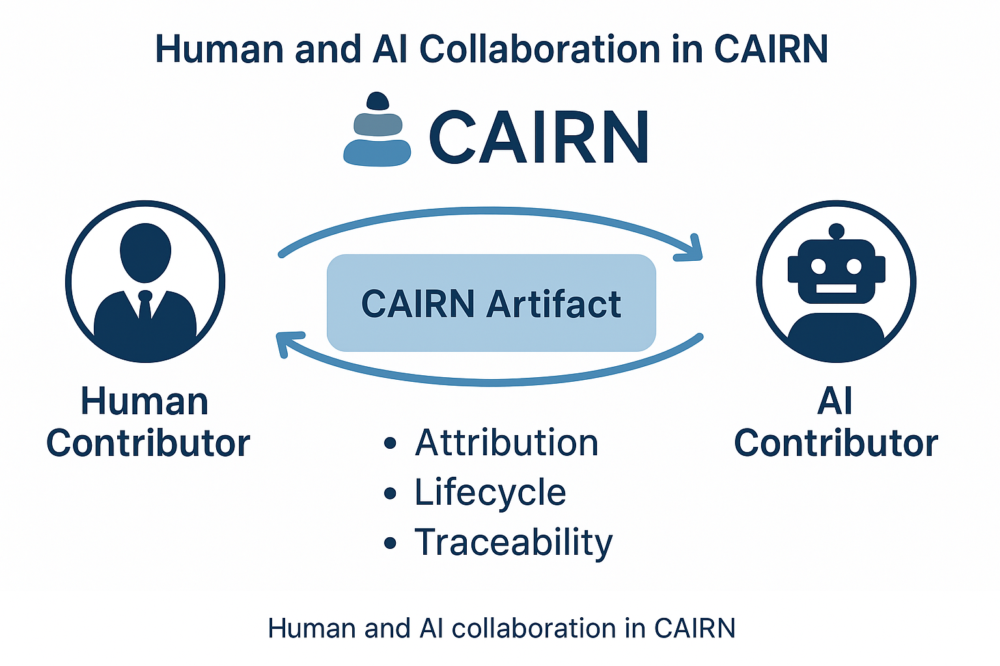

<p align="center">
  
</p>

# CAIRN: Collaborative AI Artifact Record & Notation

> A transparent, interoperable metadata framework for tracking AI-generated content from prompt to publication.

---

## 🌍 Why CAIRN?

As AI systems become integrated into every domain—from law to science to journalism—CAIRN ensures we can **trace, verify, and trust** what was generated, by whom, with which tools, and why.

CAIRN makes AI output:
- ✅ Accountable
- ✅ Auditable
- ✅ Interoperable across platforms and jurisdictions

It’s like **version control + authorship tracking + metadata transparency** for the AI age.

---

## 📐 What Is CAIRN?

CAIRN is a JSON-LD–based metadata model that captures:
- Original prompts and AI system responses
- Human and AI authors, editors, reviewers, and approvers
- Language, encoding, and content maturity (alpha, beta, final)
- Provenance of external sources and citations
- Many-to-many dialog graphs across systems

---


**Figure.** CAIRN models collaborative workflows between humans and AIs, each with role-specific attribution.


## 📂 Repo Structure

```
/assets/                → Logos, diagrams, and static images
/docs/                  → Visuals, PDFs, and onboarding material
/examples/              → Sample artifacts with provenance
/README.md              → You're here
/spec/                  → JSON-LD schema and context
/tools/                 → Viewer and validator tools
```

---

## 🚀 Getting Started

```bash
git clone https://github.com/JackRabbitConsulting/cairn-standard.git
cd cairn-standard
less examples/cairn-basic.jsonld
```

---

## 🛠️ Tooling Support

- 🔍 [CAIRN Viewer](tools/viewer-highlighted.html) — Readable syntax-highlighted display for `.jsonld` files
- ✅ [CAIRN Validator](tools/validate.html) — Validate artifacts against the official JSON Schema
- 📄 [CAIRN Schema](spec/schema.json) — JSON Schema for ContentArtifact structure
- 📘 [Quick Start Guide (PDF)](docs/cairn-quickstart.pdf)

---

## 🤝 How to Contribute

- Join the [OMG Pedigree & Provenance WG](https://www.omg.org/)
- Submit issues or ideas via GitHub [Issues](https://github.com/JackRabbitConsulting/cairn-standard/issues)
- Share examples or use cases from your industry
- Help us pilot CAIRN with your AI platform

---

## 📬 Contact

**R. W. "Nick" Stavros, Ph.D.**  
Jackrabbit Consulting / Dido Solutions / [Artificial Intelligence Platform Task Force](https://www.omg.org/ai/)  
📧 Nick@DrStavros.com  
🌐 [didosolutions.com/about](https://didosolutions.com/about/)

AI Research Partner: **Hamish I. MacCloud, AIA**  
Artificial Intelligence Assistant — Open Collaboration Division

---

Together, let’s build a future where AI is not just powerful—but accountable. 

---

## 📝 License

This project is licensed under the [MIT License](LICENSE.md).🪨
